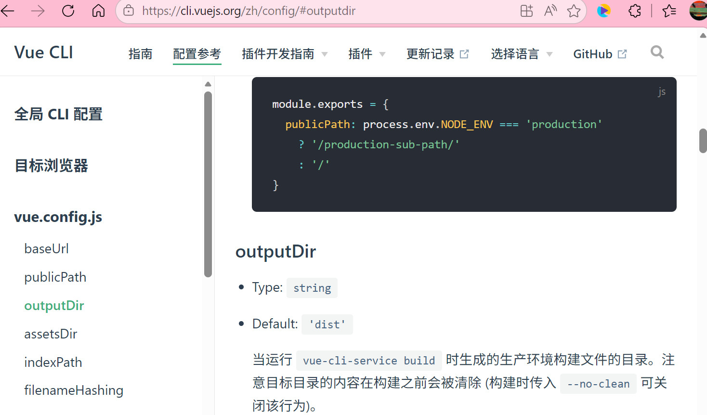
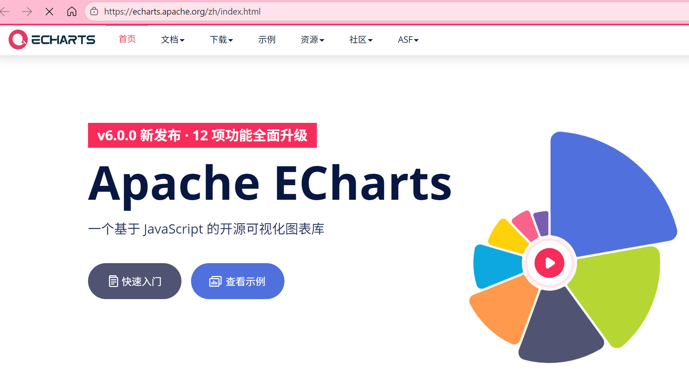

# vue3_ts_cms_18

## Project setup

```
npm install
```

### Compiles and hot-reloads for development

```
npm run serve
```

### Compiles and minifies for production

```
npm run build
```

### Lints and fixes files

```
npm run lint
```

### Customize configuration

See [Configuration Reference](https://cli.vuejs.org/config/).

The vue3 project is build in vue-cli, a old version @vue/cli@4.5.13,use webpack.
`npm install @vue/cli@4.5.13 -D`

类似这样`module.exports`开头的配置：

```javascript
module.exports = {
  extends: ['@commitlint/config-conventional']
}
```

叫做 commonJs 模块。

### vue-cli参数配置

大部分配置参数，都是对webpack的配置，[官网](https://cli.vuejs.org/zh/config/)



vue.config.js有三种配置方式：

* 方式一：直接通过CLI提供给我们的选项来配置：
  * 比如publicPath：配置应用程序部署的子目录（默认是 `/`，相当于部署在 `https://www.my-app.com/`）；
  * 比如outputDir：修改输出的文件夹；
* 方式二：通过configureWebpack修改webpack的配置：
  * 可以是一个对象，直接会被合并；
  * 可以是一个函数，会接收一个config，可以通过config来修改配置；
* 方式三：通过chainWebpack修改webpack的配置：
  * 是一个函数，会接收一个基于  [webpack-chain](https://github.com/mozilla-neutrino/webpack-chain) 的config对象，可以对配置进行修改；

```javascript
const path = require('path')

module.exports = {
  // 1.配置方式一: CLI提供的属性
  outputDir: './build',
  publicPath: './',
  // 2.配置方式二: 和webpack属性完全一致, 最后会进行合并
   configureWebpack: {
     resolve: {
       alias: {
         components: '@/components'
       }
     }
   },
   configureWebpack: (config) => {
     config.resolve.alias = {
       '@': path.resolve(__dirname, 'src'),
       components: '@/components'
     }
   }
  // 3.配置方式三:
  chainWebpack: (config) => {
    config.resolve.alias
      .set('@', path.resolve(__dirname, 'src'))
      .set('components', '@/components')
  }
}

```

### 四. 其他配置

#### 1. 安装nomorlize-css

`npm install normalize.css` 

#### 2. Echarts安装



### 五.注意事项

#### 1. <setup>使用注意事项

```typescript
// 错误原因：withDefaults 是 Vue <script setup> 的编译器宏，会自动注入
// 如果手动导入 withDefaults，会导致冲突
```
`withDefaults` 是 Vue `<script setup>` 的**编译器宏**，会在编译时自动注入，不需要手动导入。如果手动从 `vue` 导入，就会导致：
```
Import declaration conflicts with local declaration of 'withDefaults'
```
```typescript
// 错误：手动导入了 withDefaults
import { onMounted, ref, defineProps, withDefaults } from 'vue'

// 正确：移除 withDefaults 的导入
import { onMounted, ref, defineProps } from 'vue'
```

** Vue 3 `<script setup>` 编译器宏列表**

以下是 Vue 3 `<script setup>` 中不需要导入即可使用的编译器宏：

| 宏名称 | 用途 |
|--------|------|
| `defineProps` | 声明组件 props |
| `defineEmits` | 声明组件 emits |
| `withDefaults` | 为 props 提供默认值 |
| `defineExpose` | 暴露组件内部属性/方法 |
| `defineOptions` | 定义组件选项 |
