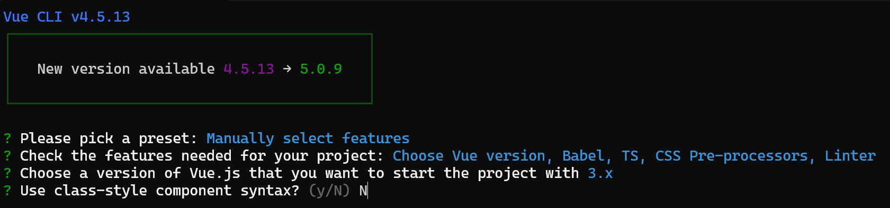
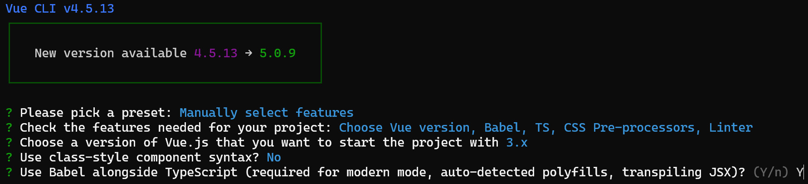
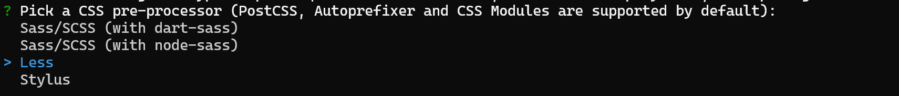
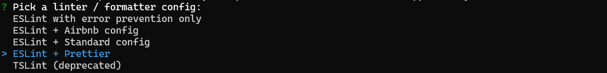
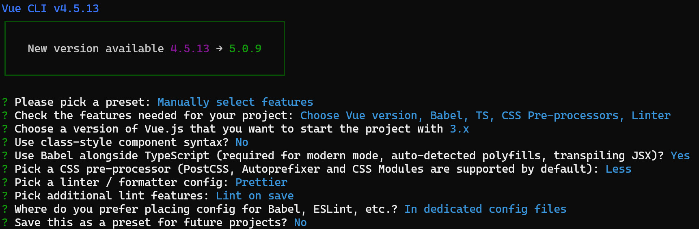
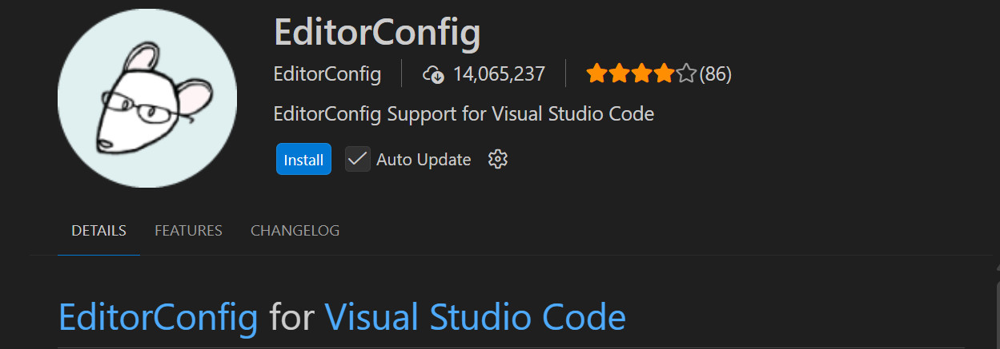
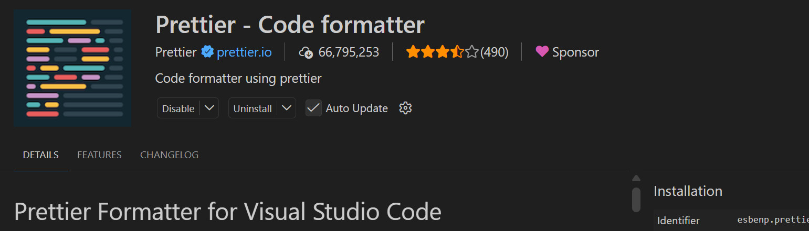
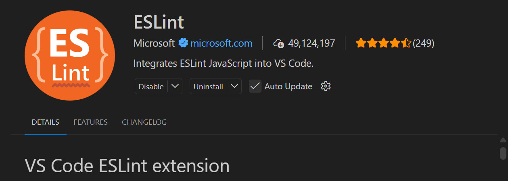

# 创建项目

### 一. 创建

局部安装的vue-cli版本：`npx vue create vue3_ts_cms_18`，否则`npm vue create vue3_ts_cms_18`



TypeScript的编译有两种方式，一种是typescript自带的tsc，

另一种是babel工具，babel可以帮助添加一些polyfill，代码补丁，一般选babel.



css预处理器，可以选Less，其他也可以：



代码优化：



创建项目的所有选项如下：



### 二. 配置

#### 2.1  editorconfig配置


EditorConfig有助于为不同IDE编辑器上处理同一项目的多个开发人员维护一致的编码风格



创建`.editorconfig`文件，内容：

```apl
# http://editorconfig.org

root = true

charset = utf-8 #文件字符集
indent_style = space #缩进风格(tab|space)
indent_size = 2 # 缩进大小
end_of_line = lf # 换行类型(lf|cr|crlf)
insert_final_newline = true # 始终在文件末尾插入一个新行
trim_trailing_whitespace = true # 去除行首的任意空白字符

[*.md] # 所有md文件
max_line_length = off
trim_trailing_whitespace = false

```

#### 2.2.使用prettier工具

Prettier是一款强大的代码格式化工具，支持JavaScript、TypeScript、CSS、SCSS、Less、JSX、Angular、Vue、GraphQL、JSON、Markdown等语言，基本上
前端能用到的文件格式它都可以搞定，是当下最流行的代码格式化工具。

1. 安装prettier
   `npm insta11 prettier -D `

2. 配置.prettierrc文件：
   - [x] useTabs：使用tab缩进还是空格缩进，选择false；
   - [x] tabWidth：tab是空格的情况下，是几个空格，选择2个；
   - [x] printWidth：当行字符的长度，推荐80，也有人喜欢100或者120；
   - [x] singleQuote：使用单引号还是双引号，选择true，使用单引号；
   - [x] trailingComma：在多行输入的尾逗号是否添加，设置为none：
   - [x] semi：语句未尾是否要加分号，默认值true，选择false表示不加：

```json
{
  "useTabs": false,
  "tabwidth": 2,
  "printwidth": 80,
  "singleQuote": true,
  "trai1ingComma": "none",
  "semi": false
}
```

3. 创建`.prettierignore`文件：

```apl
/dist/*
.local
.output.js
/node_modules/**

**/*.svg
**/*.sh

/public/*
```

4. 安装prettier插件

   

5 .测试prettier是否生效
    。测试一在代码中保存代码：
    。测试二：配置一次性修改的命令；在package.json中配置一个scripts:
    ```"prettier":"prettier --write ."```，执行 `npm run prettier`可以批量格式化文件。

#### 2.3. eslint代码检查

创建项目的时候已经选择了eslint，但是也应该安装插件



有时候，prettier与eslint的规则会有冲突，需要解决冲突：

需要安装 `npm install eslint-plugin-prettier eslint-config-prettier -D`

编辑.eslintrc.js文件，添加`plugin:prettier/recommended`：

```json
extends: [
    'plugin:vue/vue3-essential',
    'eslint:recommended',
    '@vue/typescript/recommended',
    '@vue/prettier',
    '@vue/prettier/@typescript-eslint',
    'plugin:prettier/recommended'
  ],
```

#### 2.4. gitHusky和eslint

虽然项目使用eslint了，但是不能保证组员提交代码之前都将eslint中的问题解决掉了：

也就是我们望保证代码仓库中的代码都是符合eslint规范的;
如果不符合eslint规范，那么自动通过规范进行修复;
那么我们需要在组员执行git commit命令的时候对其进行校验，支那么如何做到这一点呢？

可以通过Husky工具：

> husky是一个githook工具，可以帮助我们触发git提交的各个阶段：pre-commit、commit-msg、pre-push 
>
> 如何使用husky呢？
> 这里我们可以使用自动配置命令：
> `npx husky-init && npm install`或`npx husky-init '&&' npm install`
>
>  这里会做三件事：
> 1.安装husky相关的依赖：
>
> 2.创建.husky文件
>
> 3.在package.json添加`"prepare": "husky install"`

将.husky\pre-commit中改为执行lint命令：

```sh
#!/usr/bin/env sh
. "$(dirname -- "$0")/_/husky.sh"

npm run lint
```

#### 2.5 commitizen

如果每次手动来编写commit 是比较廉烦的事情，我们可以使用一个工具：Commitizen

> Commitizen是一个帮助我们编写规范commitmessage的工具；
>
> 1. 安装Commitizen
>    `npm install commitizen -D`
>
> 2. 安装cz-conventional-changelog，并且初始化cz-conventional-changelog:
>
>    这个命令会帮助我们安装cz-conventional-changelog,
>
>    `npx commitizen init cz-conventional-changelog --save-dev --save-exact`
>
>    并且在package.json中进行配置：
>
>    ```json
>    "config": {
>        "commitizen": {
>          "path": "./node_modules/cz-conventional-changelog"
>        }
>      }
>    ```

这个时候我们提交代码，需要先执行`git add .`，然后执行`npx cz`，会提示手动选择提交类型，

* 第一步是选择type，本次更新的类型

| Type     | 作用                                                         |
| -------- | ------------------------------------------------------------ |
| feat     | 新增特性 (feature)                                           |
| fix      | 修复 Bug(bug fix)                                            |
| docs     | 修改文档 (documentation)                                     |
| style    | 代码格式修改(white-space, formatting, missing semi colons, etc) |
| refactor | 代码重构(refactor)                                           |
| perf     | 改善性能(A code change that improves performance)            |
| test     | 测试(when adding missing tests)                              |
| build    | 变更项目构建或外部依赖（例如 scopes: webpack、gulp、npm 等） |
| ci       | 更改持续集成软件的配置文件和 package 中的 scripts 命令，例如 scopes: Travis, Circle 等 |
| chore    | 变更构建流程或辅助工具(比如更改测试环境)                     |
| revert   | 代码回退                                                     |

* 第二步选择本次修改的范围（作用域）

* 第三步选择提交的信息

* 第四步提交详细的描述信息

* 第五步是否是一次重大的更改

* 第六步是否影响某个open issue

我们也可以在scripts中构建一个命令来执行 cz：

#### 2.6. 代码提交验证

如果我们按照cz来规范了提交风格，但是依然有同事通过 `git commit` 按照不规范的格式提交应该怎么办呢？

* 我们可以通过commitlint来限制提交；

1.安装 @commitlint/config-conventional 和 @commitlint/cli

```shell
npm i @commitlint/config-conventional @commitlint/cli -D
```

2.在根目录创建commitlint.config.js文件，配置commitlint

```js
module.exports = {
  extends: ['@commitlint/config-conventional']
}
```

3.使用husky生成commit-msg文件，验证提交信息：

```shell
npx husky add .husky/commit-msg "npx --no-install commitlint --edit $1"
```

在`package.json`添加命令`"commit": "cz"`，然后提交可以使用`npm run commit`

#### 2.7 vue.config.js配置

大部分配置参数，都是对webpack的配置，[官网](https://cli.vuejs.org/zh/config/)

vue.config.js有三种配置方式：

* 方式一：直接通过CLI提供给我们的选项来配置：
  * 比如publicPath：配置应用程序部署的子目录（默认是 `/`，相当于部署在 `https://www.my-app.com/`）；
  * 比如outputDir：修改输出的文件夹；
* 方式二：通过configureWebpack修改webpack的配置：
  * 可以是一个对象，直接会被合并；
  * 可以是一个函数，会接收一个config，可以通过config来修改配置；
* 方式三：通过chainWebpack修改webpack的配置：
  * 是一个函数，会接收一个基于  [webpack-chain](https://github.com/mozilla-neutrino/webpack-chain) 的config对象，可以对配置进行修改；

```javascript
const path = require('path')

module.exports = {
  // 1.配置方式一: CLI提供的属性
  outputDir: './build',
  publicPath: './',
  // 2.配置方式二: 和webpack属性完全一致, 最后会进行合并
   configureWebpack: {
     resolve: {
       alias: {
         components: '@/components'
       }
     }
   },
   configureWebpack: (config) => {
     config.resolve.alias = {
       '@': path.resolve(__dirname, 'src'),
       components: '@/components'
     }
   }
  // 3.配置方式三:
  chainWebpack: (config) => {
    config.resolve.alias
      .set('@', path.resolve(__dirname, 'src'))
      .set('components', '@/components')
  }
}

```
### 三. 引入通用组件
### 3.1. vue-router集成

安装vue-router的最新版本：

```shell
npm install vue-router@next
```
或：
```shell
npm install vue-router@4.0.10
```

### 3.2 vuex集成

安装vuex：

```shell
npm install vuex@next
```
或
```shell
npm install vuex@4
```

### 3.3 element-plus集成

[网站]: https://element-plus.org/zh-CN/guide/quickstart

ElementPlus，一套为开发者、设计师和产品经理准备的基于Vue3.0的**桌面端组件库**；
如果在Vue2中都使用过element-ui，而element-plus正是element-uit针对于vue3开发的一个UI组件库。

它的使用方式和很多其他的组件库是一样的，所以学会element-plus，其他类似于ant-design-vue、NaiveUI、VantUI都是差不多的。

安装element-plus `npm install element-plus`

##### 3.3.1 全局引入

所有的组件和插件会被自动注册：

main.js:

```javascript
// ....
import ElementPlus from 'element-plus'
import 'element-plus/dist/index.css'

const app = createApp(App)
app.use(ElementPlus) // 全局引用
app.mount('#app')
```


##### 3.3.2 局部引入

开发中使用到某个组件，就对某个组件单独引入：

App.vue:

```vue
<template>
  <div class="app">
    <!-- ... -->
    <el-button>ElementPlus</el-button>
  </div>
</template>

<script lang="ts">
import { defineComponent } from 'vue'
import { ElButton } from 'element-plus'

export default defineComponent({
  components: {
    ElButton
  },
  name: 'App'
})
</script>
```

如果报错兼容性问题，可以配置：

1. vue.config.js:

   ```javascript
   module.exports = {
      // 配置webpack
     chainWebpack: (config) => {
       // 让babel-loader处理node_modules中的element-plus文件
       config.module
         .rule('js')
         .include.add(/node_modules\/element-plus/)
         .end()
         .use('babel-loader')
         .loader('babel-loader')
         .tap((options) => {
           return options
         })
     },
   }
   ```

2. babel.config.js：

   ```javascript
   module.exports = {
     presets: [
       [
         '@vue/cli-plugin-babel/preset',
         // 新增：
         {
           targets: {
             browsers: ['> 1%', 'last 2 versions', 'not dead']
           },
           useBuiltIns: 'usage',
           corejs: 3
         }
       ]
     ],
     plugins: [
       '@babel/plugin-transform-optional-chaining',
       '@babel/plugin-transform-nullish-coalescing-operator',
       '@babel/plugin-transform-logical-assignment-operators'
     ]
   }
   
   ```

##### 3.3.3 自动引入

可以自动引入样式

安装`npm install babel-plugin-import -D`

配置babel:

```javascript
module.exports = {
  presets: [
    //...
  ],
  plugins: [
    //...
    [
      'import',
      {
        libraryName: 'element-plus',
        customStyleName: (name) => {
          return `element-plus/theme-chalk/src/${name}.css`
        }
      }
    ]
  ]
}

```

但是，Element Plus 2.0.0 的组件结构和样式路径与 babel-plugin-import 的默认配置不匹配。Element Plus 2.0.0 已经内置了按需导入的支持，不需要使用 babel-plugin-import 插件。

不需要修改 babel.config.js 文件，可移除 babel-plugin-import 的配置。
